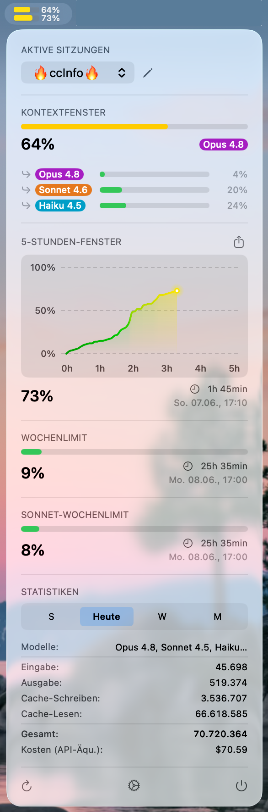

# ccInfo

> Know your limits. Use them wisely.

A native macOS MenuBar app for real-time monitoring of your Claude usage.

<p align="center">
  
</p>


## Features

### Usage Monitoring

- **5-Hour Window Tracking** – Current session utilization with color-coded area chart, burn rate warning, reset countdown, and shareable chart export
- **Weekly Limit Monitoring** – 7-day quota with separate Sonnet and Opus breakdowns (real data from claude.ai)
- **Context Window Status** – Monitor your main context and active subagent context windows with model badge, utilization bar, and autocompact warning. The window size (200K or 1M) is detected per model from live rate data
- **Configurable MenuBar Slots** – Choose which two metrics to display in the MenuBar (5-hour, weekly, sonnet weekly, or context window)

### Session Intelligence

- **Multi-Session Switcher** – Switch between active Claude Code sessions via dropdown menu (with configurable activity threshold)
- **Custom Session Names** – Rename any session via the pencil button next to the switcher or in Settings → Sessions; names persist across restarts and replace auto-derived project names everywhere
- **Token Statistics** – Input/output token counts aggregated by session, today, week, or month
- **Dynamic Cost Estimation** – Live model pricing via LiteLLM with per-model cost calculation

### Auto-Updates & Configuration

- **Sparkle Auto-Updates** – Automatic update checks every 4 hours with in-app install via Sparkle, configurable in Settings
- **Configurable Refresh Interval** – Manual or automatic polling from 30 seconds to 10 minutes
- **Launch at Login** – Start ccInfo automatically with macOS
- **Secure Authentication** – Session tokens stored locally with restricted file permissions
- **VoiceOver Accessible** – Full VoiceOver support across all MenuBar components

## Installation

### Download

1. Download the latest release from [Releases](https://github.com/stefanlange/ccInfo/releases)
2. Open the DMG and drag the app to `/Applications`
3. **First launch:** The app is not notarized by Apple. On first launch:
   - **Right-click** (or Ctrl+click) on ccInfo.app → **Open** → click **Open** in the dialog
   - *Or* go to **System Settings** → **Privacy & Security** → scroll down and click **Open Anyway**
   - *Or* run `xattr -cr /Applications/ccInfo.app` in Terminal
4. Launch and sign in with your Claude account

### Build from Source

```bash
git clone https://github.com/stefanlange/ccInfo.git
cd ccInfo
open ccInfo/ccInfo.xcodeproj
```

Build with ⌘B, run with ⌘R.

## Requirements

- macOS 14.0 (Sonoma) or later
- Active Claude Pro or Max subscription

## Privacy

- Stores tokens locally in Application Support (chmod 600)
- Communicates only with claude.ai and the LiteLLM pricing API
- Collects no telemetry
- Sends no data to third parties

See [PRIVACY.md](PRIVACY.md) for details.

## Release Notes

See [RELEASENOTES.md](RELEASENOTES.md) for the full changelog.

## License

MIT License – see [LICENSE](LICENSE) for details.

---

*Not affiliated with Anthropic. Claude is a trademark of Anthropic, PBC.*
